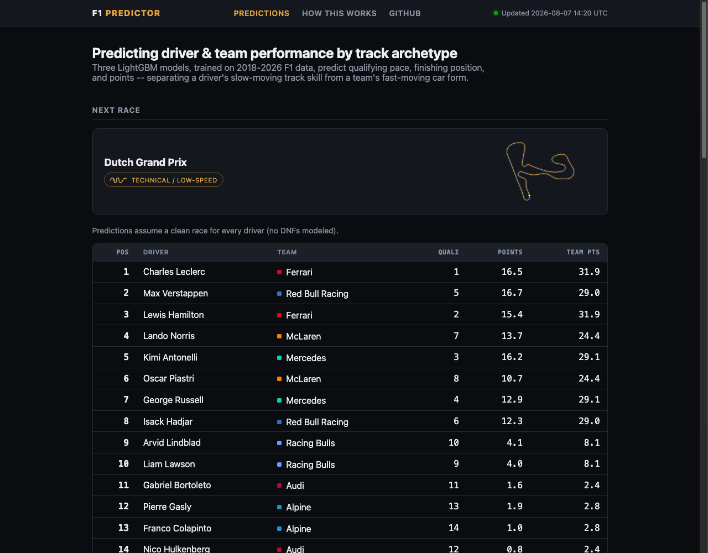

# F1 Predictor

[](https://github.com/robcalimente/f1-predictor/actions/workflows/pre_race.yml)
[](https://github.com/robcalimente/f1-predictor/actions/workflows/post_race.yml)

Predicts Formula 1 driver and team performance by track archetype: qualifying pace (% gap to pole),
finishing position, and points, split out separately for drivers and constructors. Every circuit's
outline is real GPS telemetry from that track's most recent race, not a stock image.

**Live dashboard: [robcalimente.github.io/f1-predictor](https://robcalimente.github.io/f1-predictor/)**



## What this is

A gradient-boosted model trained on 2018-2026 F1 data (via [FastF1](https://github.com/theOehrly/Fast-F1))
that separates two signals that move at very different speeds:

- **Driver skill by track archetype** — a slow-moving signal measured *relative to the driver's own
  teammate*, in the same car, at each archetype, and decayed with a 2.5-season half-life. Measuring
  absolute results instead makes this a proxy for whichever car the driver happened to have: George
  Russell scored near-zero at high-speed circuits in a 2019 Williams, which is a fact about the
  Williams. Differencing against the teammate holds the car constant.
- **Team/car form** — a fast-moving signal computed from each team's last 3-5 races plus an in-season
  trend term, reset at known regulation-change boundaries (2022, 2026). This is what captures a team
  going from back-of-the-grid to front-running (or vice versa) within a season as they bring upgrades.
  Race-pace form and qualifying-pace form are tracked separately, alongside raw car pace — speed-trap
  and best-lap, each normalized within its own race so a 340 km/h trap at Monza and a 300 km/h trap at
  Monaco say the same thing about a car relative to that day's field. Points-based form alone cannot
  tell you *why* a team scores; straight-line speed is what decides a power circuit like Monza.

It also uses each circuit's historical **wet-race** and **safety-car** rates — a circuit-level tendency
known in advance, not a live weather forecast the model can't actually have for a future race.

Every number below is out-of-sample: three independent LightGBM models, chronologically walk-forward
validated, so a prediction is never made with data from the future relative to the race it's scoring.
Full methodology, including the accuracy breakdown, model choice, and known limitations, lives on the
["How this works"](https://robcalimente.github.io/f1-predictor/methodology.html) page.

## Results

Across 2,455 walk-forward-validated driver-race predictions (2020-2026):

| Metric | Result |
|---|---|
| Pole position called correctly | 26.8% |
| Race winner called correctly | 45.5% |
| Exact podium (top 3) match | 14.0% |
| Avg. overlap with actual points scorers (top 10) | 79.8% |
| Qualifying pace MAE | 1.31 (% gap to pole) |
| Finishing position MAE | 2.90 positions |
| Points MAE / R² | 3.82 / 0.49 |
| Finish-position Spearman rank correlation | 0.69 |

The dashboard's ["How this works"](https://robcalimente.github.io/f1-predictor/methodology.html) page also
shows the model measured against a naive "everyone finishes where they qualified" baseline, and breaks
down which features actually drive each prediction (via SHAP).

## Structure

- `src/pipeline/` — data pull (FastF1), feature engineering, model training, evaluation, dashboard export
- `data/raw/` — pulled FastF1 results, 2018-2025 committed as a fixed historical baseline; 2026 refreshed
  each automated run
- `data/circuit_archetypes.csv` — manual circuit-to-archetype taxonomy
- `docs/` — static dashboard output, served via GitHub Pages
- `.github/workflows/` — scheduled Thursday (pre-race predictions) and Monday (post-race scoring) pipeline
  runs, each re-pulling the current season, retraining, and redeploying the dashboard

## Running locally

```bash
python3.10 -m venv .venv
source .venv/bin/activate
pip install -r requirements.txt

python src/pipeline/pull_data.py       # pulls 2018-2026 race/quali results via FastF1
python src/pipeline/build_features.py  # builds driver-skill and team-form features
python src/pipeline/train_model.py     # trains the three LightGBM models, walk-forward validated
python src/pipeline/generate_predictions.py  # predicts the next unraced event on the calendar
python src/pipeline/evaluate.py        # computes MAE/rank-correlation/accuracy metrics
python src/pipeline/build_dashboard.py # renders docs/ static site
```
